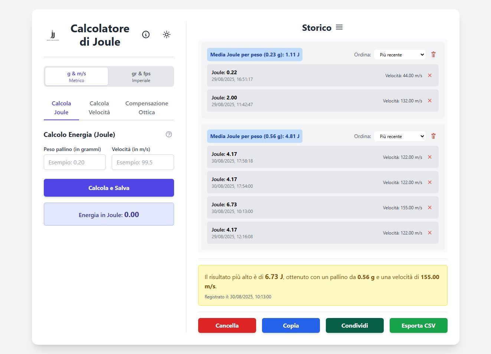

# Joule-Calc

**Joule-Calc** è una Progressive Web App (PWA) moderna e completa, progettata per gli appassionati di softair e tiro. Offre un set di strumenti avanzati per calcolare l'energia (Joule), la velocità e la compensazione dell'ottica, il tutto in un'interfaccia reattiva e facile da usare.

L'applicazione è installabile su dispositivi desktop e mobili, garantendo un accesso rapido e funzionalità offline.



## ✨ Caratteristiche Principali

*   **Calcolatore di Energia (Joule)**:
    *   Calcola l'energia cinetica del proiettile inserendo peso e velocità.
    *   Supporta unità di misura metriche (grammi, m/s) e imperiali (grani, fps).
    *   Salva automaticamente ogni calcolo in uno storico dettagliato.

*   **Calcolatore di Velocità Inverso**:
    *   Determina la velocità (in m/s e fps) necessaria per raggiungere un determinato valore di Joule con un pallino di peso specifico.

*   **Compensazione Ottica (MOA/MRAD)**:
    *   Aiuta a regolare le torrette dell'ottica traducendo lo spostamento del colpo sul bersaglio (in cm) nel numero di "click" necessari.
    *   Supporta sia MOA (Minute of Angle) che MRAD (Milliradian).
    *   Permette di configurare il valore di correzione per ogni click (es. 1/4 MOA, 0.1 MRAD).

*   **Storico Avanzato**:
    *   I calcoli vengono raggruppati per peso del pallino.
    *   Visualizza la media dei Joule per ogni gruppo.
    *   Permette di ordinare i risultati per data o per valore di Joule.
    *   Funzionalità di eliminazione per singoli calcoli o interi gruppi.

*   **Esportazione e Condivisione**:
    *   Copia un riepilogo testuale dello storico o di un singolo gruppo.
    *   Esporta l'intero storico in formato CSV per l'analisi in fogli di calcolo.
    *   Condividi i risultati tramite le funzionalità native del dispositivo.

*   **Esperienza PWA Completa**:
    *   **Installabile**: Aggiungi Joule-Calc alla schermata principale del tuo dispositivo per un accesso rapido.
    *   **Funzionamento Offline**: Il Service Worker garantisce che l'app funzioni anche senza connessione a internet.
    *   **Interfaccia Adattiva**: Design ottimizzato per desktop e mobile.
    *   **Tema Chiaro/Scuro**: Scegli il tema che preferisci.
    *   **Window Controls Overlay**: Su desktop, l'app utilizza un'area della barra del titolo personalizzata per un look più nativo.

## 🛠️ Tecnologie Utilizzate

*   **Vite**: Build tool per lo sviluppo web moderno e veloce.
*   **JavaScript (ES Modules)**: Logica dell'applicazione strutturata in moduli.
*   **Tailwind CSS**: Framework CSS utility-first per un design rapido e personalizzato.
*   **Vite PWA Plugin**: Per la generazione del Service Worker (con Workbox) e l'integrazione delle funzionalità PWA.

## 🚀 Avvio in Locale

Per eseguire il progetto sul tuo computer, segui questi passaggi:

1.  **Clona il repository**:
    ```bash
    git clone https://github.com/ARES2302/Joule-Calc.git
    cd Joule-Calc
    ```

2.  **Installa le dipendenze**:
    Assicurati di avere [Node.js](https://nodejs.org/) installato.
    ```bash
    npm install
    ```

3.  **Avvia il server di sviluppo**:
    ```bash
    npm run dev
    ```

4.  Apri il browser e naviga all'indirizzo fornito nel terminale (solitamente `http://localhost:5173`).

##  Build per la Produzione

Per creare la versione ottimizzata per il deploy:

```bash
npm run build
```

I file verranno generati nella cartella `dist`. Puoi testare la build in locale con:

```bash
npm run preview
```

---
